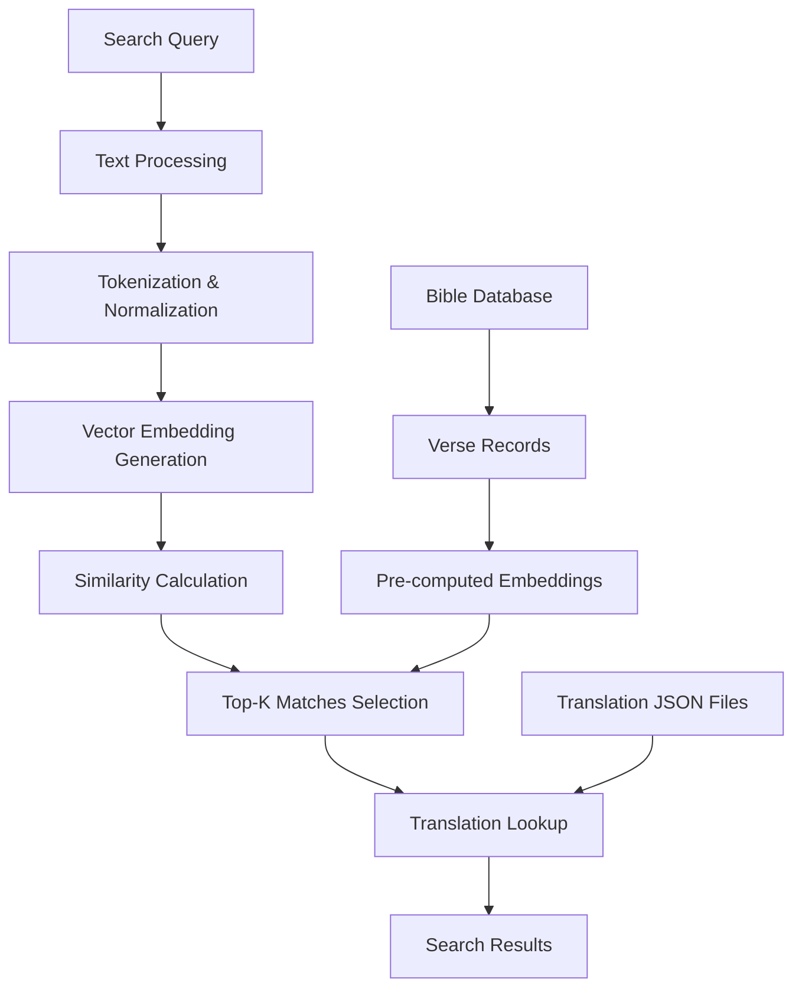

# Bible Data Vector Embeddings Pipeline & Search Service

This module provides a sophisticated Bible search service using vector embeddings for semantic similarity search across multiple Bible translations.

## Overview

The Bible search service enables semantic search across Bible verses using vector embeddings. It supports multiple translations and provides efficient similarity matching between search queries and Bible verses.

## Architecture



## How It Works

### 1. Data Ingestion Pipeline

The system processes Bible translations through the following pipeline:

1. **Translation Data**: Raw Bible text from various translations (NLT, KJV, ESV, etc.)
2. **Embedding Generation**: Each verse is converted to a vector embedding using a hashing-based approach
3. **Database Storage**: Embeddings and metadata are stored in SQLite for efficient retrieval
4. **Translation Cache**: JSON files provide quick access to verse text across different translations

### 2. Search Process

When a search query is received:

1. **Query Processing**: The search term is normalized and tokenized
2. **Vector Creation**: A query vector is generated using the same hashing algorithm
3. **Similarity Scoring**: Dot product is calculated between query vector and all verse embeddings
4. **Top-K Selection**: The highest-scoring verses are selected
5. **Translation Resolution**: If needed, results are translated to the requested Bible version

### 3. Key Components

- **`searchBible()`**: Main entry point for Bible search functionality
- **Vector Embeddings**: Fixed-dimensional vectors representing verse content
- **Token Hashing**: Consistent hashing algorithm for vector generation
- **Translation Support**: Multi-version Bible text lookup
- **Result Ranking**: Cosine similarity-based scoring

## Usage

```typescript
import { searchBible } from "./index";

const results = await searchBible({
  term: "love your neighbor",
  translation: "NLT",
  limit: 10,
});
```

## Configuration

- **Default Translation**: NLT (New Living Translation)
- **Default Limit**: 5 results
- **Maximum Limit**: 50 results
- **Embedding Dimension**: Configurable vector size

## Data Sources

For detailed information about the Bible translations data used by this service, see [translations/README.md](./translations/README.md).

## Database Requirements

The system requires a pre-populated SQLite database at `data/bible.sqlite` containing:

- Verse metadata (book, chapter, verse, text)
- Pre-computed vector embeddings
- Translation information
- Embedding dimension metadata

To generate the database, run: `pnpm bible:ingest`

## Performance Considerations

- **Vector Similarity**: Uses efficient dot product calculations
- **Memory Management**: Lazy loading of translation data
- **Caching**: Translation JSON files are cached for performance
- **Batch Processing**: Optimized for multiple search operations

## Error Handling

- Graceful handling of missing translation data
- Validation of search parameters and limits
- Proper error messages for database access issues
